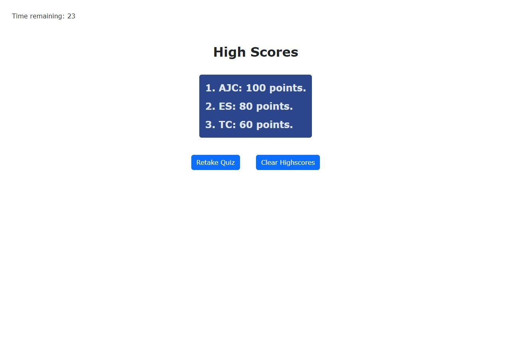

# 04 Web APIs: Code Quiz

This project presents a timed code quiz that's made up of multiple-choice questions. This app runs in the browser and features dynamically updated HTML and CSS powered by JavaScript code. It also features a clean, responsive and polished user interface.

## User Story

```
AS A coding boot camp student
I WANT to take a timed quiz on JavaScript fundamentals that stores high scores
SO THAT I can gauge my progress compared to my peers
```

## Acceptance Criteria

```
GIVEN I am taking a code quiz
WHEN I click the Start button
THEN a timer starts and I am presented with a question
WHEN I answer a question
THEN I am presented with another question
WHEN I answer a question incorrectly
THEN time is subtracted from the clock
WHEN all questions are answered or the timer reaches 0
THEN the game is over
WHEN the game is over
THEN I can save my initials and score
```

The quiz complies with the described acceptance criteria. The user can take a timed quiz and go through all the questions in a clean and responsive interface. Also, the user can record initials at the end of the quiz and check the high scores from the home page by clicking on the link (only displays scores section when there are high scores recorded in the local memory). Finally, the user can clear the high scores in the high scores section.


## Links to the Webpage and the Repository:

[Quiz Website](https://alexjcturbo.github.io/code_quiz/)

[GitHub Repository](https://github.com/AlexJCturbo/code_quiz)


## Screenshot of the Website

Home page of the quiz application.


Navigation through the questions.


The user can input the initials to record the score in the local memory.


After the user inputs the initals, the high scores page is displayed where the user can select to retake the quiz or clear the highscores.
